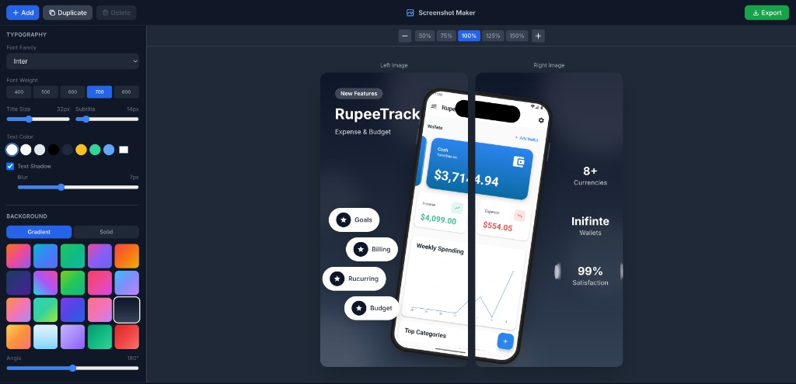

# Screenshot Maker

A powerful web-based tool for creating beautiful app store screenshots with device frames, layouts, and customizable elements.

[](https://github.com/furqanullah717/Screenshot-Maker)
[](https://furqanullah717.github.io/Screenshot-Maker/)

## Demo



## Features

- **30+ Device Frames** - iPhone 16/15/14/13 series, Samsung S24/S23, Pixel 9/8, OnePlus, Xiaomi
- **Multi-Phone Layouts** - Side-by-side, stacked, fan, and perspective layouts with individual phone controls
- **Phone Selection & Controls** - Click to select phones, adjust position, rotation, scale, and image per phone
- **Layout Templates** - Classic, Modern, Minimal, Split Pair, and more
- **Feature Pills** - Add floating feature badges with icons
- **Statistics Badges** - Display stats with laurel wreath decorations
- **Background Customization** - Solid colors or gradient presets
- **Typography Controls** - Font family, size, weight, and shadow
- **Export Options** - Multiple sizes and formats (PNG, JPEG, WebP)
- **Batch Export** - Export all screenshots at once
- **LocalStorage Persistence** - Your work is automatically saved

## Getting Started

### Prerequisites

- Node.js 18+ 
- npm or yarn

### Installation

```bash
npm install
```

### Development

```bash
npm run dev
```

### Build

```bash
npm run build
```

### Preview Production Build

```bash
npm run preview
```

## Deployment

This project is configured for GitHub Pages deployment. Push to the `main` branch to trigger automatic deployment.

## Tech Stack

- React 18
- TypeScript
- Vite
- Tailwind CSS
- Zustand (State Management)
- html2canvas (Export)

## Links

- **Live Demo**: [https://furqanullah717.github.io/Screenshot-Maker/](https://furqanullah717.github.io/Screenshot-Maker/)
- **GitHub Repository**: [https://github.com/furqanullah717/Screenshot-Maker](https://github.com/furqanullah717/Screenshot-Maker)

## License

MIT
